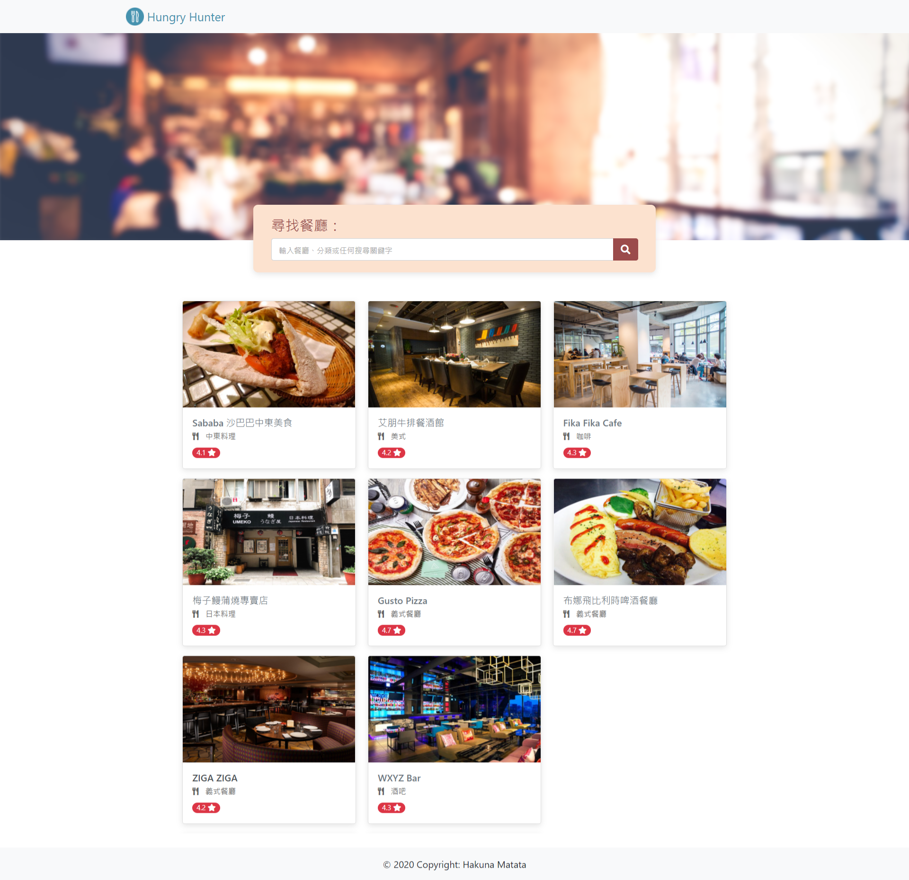

# Hunger Hunter

It's a restaurant website for practice with node.js and express.js.

### Users could...

- see all the reataurant name, category, rating and description in our datasets.

- click the card to see restaurant details, such as address and phone number.

- search restaurant by the keyword.

  

### Getting Started

Clone repository to your local project

```bash
git clone git@github.com:ccyang02/hunger_hunter.git
```

Install dependencies

```bash
cd hunger_hunter
npm install
```

Run the project and show output information on the terminal

```bash
npm run dev

> Express is listening on port 3000
```

### Built with

- Node.js: 10.16.0
- express: 4.17.1

- express-handlebars: 5.1.0